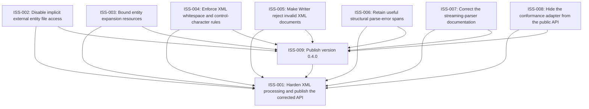

# Markdown Issue Index

Generated by derive-tracker.wasm

## Ready Queue

| ID | Priority | Type | Assignee | Title | Labels |
| --- | ---: | --- | --- | --- | --- |
| [ISS-006](ISS-006.md) | 2 | bug | codex | Retain useful structural parse-error spans | parser, diagnostics, source-span |

## Unresolved Issues

| ID | Status | Priority | Type | Assignee | Blocked by | Blocks | Title |
| --- | --- | ---: | --- | --- | --- | --- | --- |
| [ISS-001](ISS-001.md) | in_progress | 1 | epic | codex | ISS-006, ISS-009 | none | Harden XML processing and publish the corrected API |
| [ISS-009](ISS-009.md) | open | 1 | chore | unassigned | ISS-006 | ISS-001 | Publish version 0.4.0 |
| [ISS-006](ISS-006.md) | open | 2 | bug | codex | none | ISS-001, ISS-009 | Retain useful structural parse-error spans |

## Dependency Graph

## Warnings

None.

